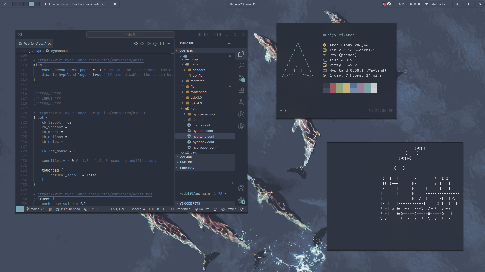
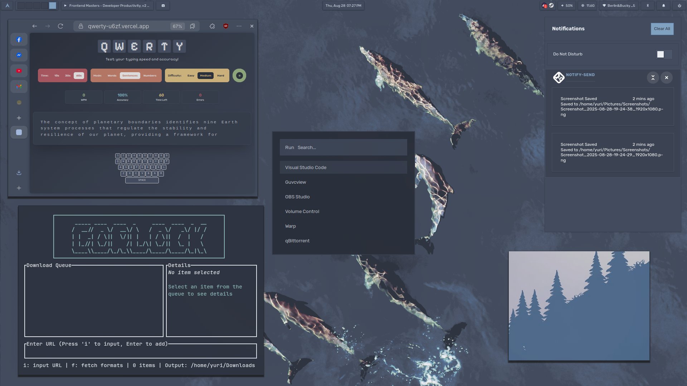

<div align="center">

# 🌊 dotfiles

*personal configuration files for arch linux with hyprland*

[](https://archlinux.org/)
[](https://hyprland.org/)
[](https://fishshell.com/)

</div>

---


<div align="center">

<br>

**some screenshots:**



<br>



<br>

**quick start:**

</div>

```bash
git clone https://github.com/2Yuri-afk/dotfiles.git ~/dotfiles
cd ~/dotfiles
stow .
```

